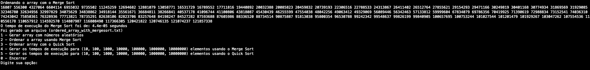
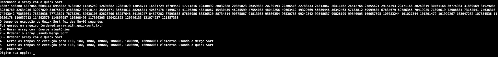
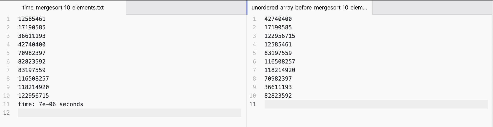
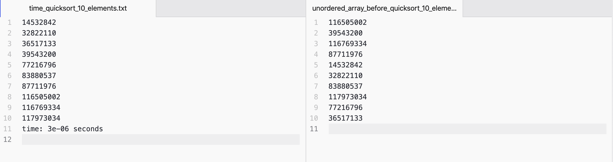
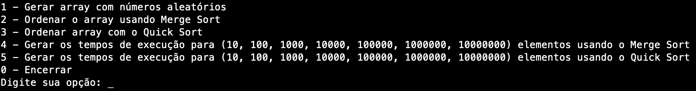

# Sorting

**Número da Lista**: 4<br>
**Conteúdo da Disciplina**: Dividir e Conquistar<br>

## Aluno
|Matrícula | Aluno |
| -- | -- |
| 16/0133394  |  Lucas Fellipe Carvalho Moreira |

## Sobre 
<p align="justify"> &emsp;&emsp; O projeto consiste na aplicação dos algoritmos <i>Merge Sort</i> e <i>Quick Sort</i>. É gerado um arquivo com (10, 100, 1000, 10000, 100000, 1000000, 10000000) elementos de forma randômica definido pelo usuário. Os algoritmos são aplicados nesse arquivo gerado para que haja a ordenação (de forma crescente) e para gerar o tempo de execução. Além disso, tem-se a opção de gerar o tempo de execução, tanto para o <i>Merge Sort</i>, quanto para o <i>Quick Sort</i>, para todos os valores (10, 100, 1000, 10000, 100000, 1000000, 10000000). Esses arquivos ficam na pasta `times_mergesort` e `times_quicksort`. Em cada arquivo gerado, tem-se o array ordenado e o tempo de execução do algoritmo de ordenação definido pelo usuário. </p>

## Screenshots

* Array de 100 elementos randômicos gerado. <br>


* Array ordenado utilizando o <i>Merge Sort</i> com o tempo de execução e gerando um arquivo com os elementos ordenados <br>




* Array ordenado utilizando o <i>Quick Sort</i> com o tempo de execução e gerando um arquivo com os elementos ordenados <br>




* Array ordenado do lado esquerdo utilizando o <i>Merge Sort</i> com o tempo de execução e do lado direito o array desordenado <br>




* Array ordenado do lado esquerdo utilizando o <i>Quick Sort</i> com o tempo de execução e do lado direito o array desordenado




## Instalação 
**Linguagem**: C++17<br>

* Clone o repositório

```https://github.com/projeto-de-algoritmos/D-C_sorting.git```

* Logo após, abra o terminal e digite: 

```cd D-C_sorting```

* Depois que estiver na pasta, execute o comando:

```make``` e, logo em seguida, digite o comando ```make run``` e siga as opções do menu.

* Quando acabar de usar o projeto, digite:

```make clean``` para apagar os arquivos da pasta bin e da pasta obj.

## Uso 
Para usar, basta digitar/seguir as opções do menu:
 <br>
Opções:
* 1 - Gera um array com números aleatórios fora de ordem com (10, 100, 1000, 10000, 100000, 1000000, 10000000) elementos; <br>
     <br>
* 2 - Faz a ordenação do array utilizando o algoritmo do <i>Merge Sort</i>
* 3 - Faz a ordenação do array utilizando o algoritmo do <i>Quick Sort</i>
* 4 - Gera os temspos de execução para um array com (10, 100, 1000, 10000, 100000, 1000000, 10000000) elementos utilizando o <i>Merge Sort</i>;
* 5 - Gera os temspos de execução para um array com (10, 100, 1000, 10000, 100000, 1000000, 10000000) elementos utilizando o <i>Quick Sort</i>;
* 0 - Encerrar.
